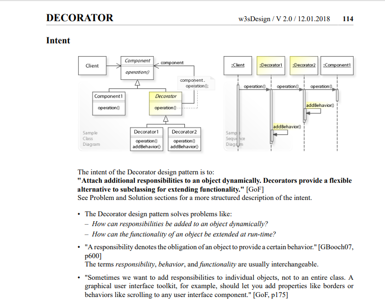

# designPattern
This reporsitory contains the design pattern with examples

#Decorator pattern example
It attaches additional responsibility to object dynamically.
It provide a flexible alternative to sub classing for extending functionality.

